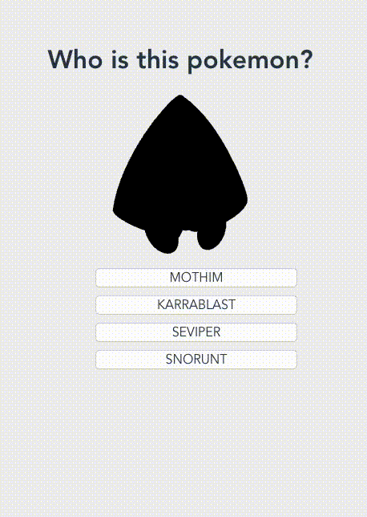

<h2 align="center">Pokemon Game</h2>
<h4 align="center">Web Aplication developed on Vue.js</h4>
<h2 align="center">

</h2>

<h1 align="center" >
    
</h1>

# 📖 Contents
<ul>
  <li><a href="#-about">About</a></li>
  <li><a href="#-demonstration">Demonstration</a></li>
  <li><a href="#-features">Features</a></li>
  <li><a href="#credits">Credits</a></li>
</ul>

# 📃 About

**Pokemon Game** is a questionary game where the player tries to guess what the pokemon in the image is. Developed using vue.js framework.

# 🌄 Demonstration

* **Initial screen**
  

* **Guessing the wrong Pokemon**

* **Guessing the correct Pokemon**

# 🔥 Features

- mount

- Axios in Vue.js

- Broadcast events

- Listen to custom events

- Functions to generate random information

- Logic to solve the need of the application

# 💡Credits

This application was made thanks to the course of [Fernando Herrera](https://www.udemy.com/user/550c38655ec11/) [Vue.js de cero a experto](https://www.udemy.com/course/vuejs-fh/)
